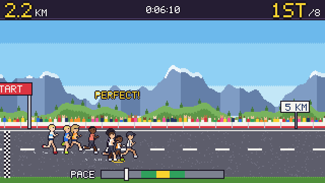

# Tour de Mini

A pixel-art sports minigame hub: a Tour de France sprint and descent, a 42.2-second marathon and an
Ironman, featuring 22 real athletes drawn as 16–32px sprites. Built with vanilla JavaScript and the
Canvas 2D API: no frameworks, no game engine, no build step.



**Status:** the Marathon is playable, and every athlete sprite is done
([sprite gallery](gallery.html)). Tour de Mini France and the Ironman are next.

## How to play

Everything is played with one button: **Space**, **Enter**, or a **tap** anywhere.

- **Menus:** tap to move to the next option, hold to select it. A meter fills while you hold.
- **Marathon:** 42.2 seconds, one per kilometre. A marker sweeps the pace bar once per km. Tap
  once each km while it crosses the middle: gold is perfect, green is good. Every km becomes a
  split, and perfect running is worth a sub-two-hour marathon. At the wall (km 30–35) the
  marker speeds up and the zone shrinks; after it, the beat comes back for the final push.

## Run it locally

The game is static files, but browsers only load ES modules over HTTP, so serve the folder:

```sh
npm run serve        # http://localhost:4173  (any static server works)
```

`npm install` is only needed for the development tools below; the game itself has no dependencies.

```sh
npm test             # unit tests (Node's built-in test runner)
npm run typecheck    # JSDoc types checked by TypeScript, no compilation
npx playwright test  # loads every page at 375, 768 and 1440px wide, walks the hub into a
                     # race, plays a full marathon, fails on console errors or overflow,
                     # and saves screenshots to screenshots/
```

## How it works

```
index.html, gallery.html   pages (the hub, and a gallery of every sprite)
pages/                     one small script per page; hub.js wires the scenes together
engine/                    game-agnostic core, pure where possible
  loop.js                  fixed 60 Hz simulation, rendering on requestAnimationFrame
  screen.js                320x180 buffer, whole-pixel scaling, letterboxing
  input.js                 the single button: Space, Enter or a tap
  director.js              one scene at a time, with a pixel wipe between them
  grid.js                  pure operations on pixel grids (stamp, outline, shear...)
  character.js             builds athlete sprites from rigs + traits, cached
  font.js, parallax.js, particles.js, animation.js, storage.js, format.js, math.js, rng.js
games/sports.js            the games the hub offers; adding a sport starts here
games/hub/                 title, sport select, athlete select, results
games/marathon/            race.js (the rules, pure) and marathon-scene.js (the drawing)
games/shared/              timing bar, one-button menu, scenery and UI used by every sport
assets/                    sprite rigs, font glyphs, palette, scenery painters, CSS
data/athletes.js           every athlete: name, team, kit, traits, stats
tests/unit, tests/visual   Node unit tests, Playwright page checks
```

A few rules hold everywhere:

- **Nothing is ever blurry.** The game draws into a 320x180 buffer. The buffer is scaled by a whole
  number of *device* pixels per game pixel, with smoothing off, so every pixel is the same size on
  any screen. On a phone held upright that means 1x, plus a hint to rotate the phone.
- **Speed never depends on frame rate.** The simulation advances in fixed 1/60 s steps, and
  animation is driven by what the athlete is doing: legs follow cadence, wheels follow distance.
- **One button.** Every game is playable with Space, Enter or a tap. The page never scrolls on
  Space, including when the game is embedded in an iframe.
- **Rules are pure, scenes only draw.** Each game's rules live in a module with no DOM, like
  `games/marathon/race.js`, so they are unit-tested directly. That includes balance: the tests
  play hundreds of races with simulated people whose taps have a normal timing error (45 ms for
  a sharp player, 100 ms for a casual one), and check that sharp players usually win, casual
  ones land mid-pack, and mashing finishes last. Timing windows are asserted to stay wide enough
  for people, not just bots.

## How sprites are defined

Sprites are grids of characters, one per pixel. Each character is a **role**, not a color: `T` is the
top (jersey or singlet), `P` shorts, `S` skin, `H` hair, `M` headwear, `O` shoes, and so on.
Lowercase means the same part on the far side of the body, drawn in a darker shade. Here is the
top of the rear-view cyclist, from `assets/sprites/rider-rear.js`:

```
......MMMM......   helmet, with a vent stripe (m)
.....MMmmMM.....
....MMMmmMMM....
.....MHHHHM.....   hair under the helmet
....TTTSSTTT....   jersey, neck
...TTTTTTTTTT...
..VTTTTTTTTTTV..   sleeves (V), cuffs (C)
.VVTTTTTTTTTTVV.
.CC.TTTTTTTT.CC.
```

Every athlete shares the same hand-drawn body frames. `engine/character.js` turns a frame into that
athlete's sprite in four steps:

1. **Compose.** Stamp the body, then stack head layers at the frame's head anchor: hair style,
   facial hair, headwear, eyewear, and a signature trait such as Pogačar's hair tuft poking out of
   his helmet.
2. **Build.** Tall athletes repeat a few marked rows (thigh, shin) and compact ones drop rows, so
   van der Poel gets long legs and Pidcock a compact frame without redrawing anything. The bike
   grows with its rider, so hands stay on the bars.
3. **Outline.** A 1px dark outline wraps the silhouette. Enclosed gaps like wheel spokes stay clear.
4. **Paint.** Each role maps to the athlete's colors. Kit patterns (`lower`, `band`, `side`...) are
   worked out from where a pixel sits within the torso, so one rule paints Visma's black lower half
   in both the side and rear views.

Each result is cached as a canvas, so drawing a sprite costs one `drawImage` call. Likeness comes
from traits, not faces: at this size a face is four pixels.

## Adding an athlete

Everything about an athlete lives in `data/athletes.js`. To add Gustav Iden to the Ironman, append:

```js
{
  id: 'iden',
  name: 'Gustav Iden',
  sport: 'ironman',
  country: 'NOR',
  team: 'Santini',
  build: 'regular',                 // compact | regular | tall
  skin: 'skinFair',                 // palette names from assets/palette.js
  hair: { style: 'short', color: 'hairDarkBrown' },
  facialHair: null,                 // 'beard' | 'moustache' | null
  eyewear: null,
  headwear: {
    run: { type: 'cap', color: 'blue' },
    bike: { type: 'helmet', color: 'white', accent: 'navy' },
  },
  kit: { ...TRI_KIT, top: 'white', accent: 'navy', pattern: 'split' },
  bike: { frame: 'navy' },
  swimCap: 'navy',
  traits: [],
  signature: 'Blue cap and a half-navy suit',
  stats: { power: 8, endurance: 9, technique: 8 },
},
```

Run `npm test`: the data tests check that every color, hair style, headwear and trait exists and
that each sport has what it needs (a helmet on the bike, a swim cap for the Ironman). Then open
`gallery.html` to see him from every angle.

## Credits

A fan tribute. Athletes are drawn from public reference photos as traits only (hair, build, kit
colors). No photos, sponsor logos or event wordmarks are used. Kit sources are listed in
[docs/athlete-research.md](docs/athlete-research.md).
